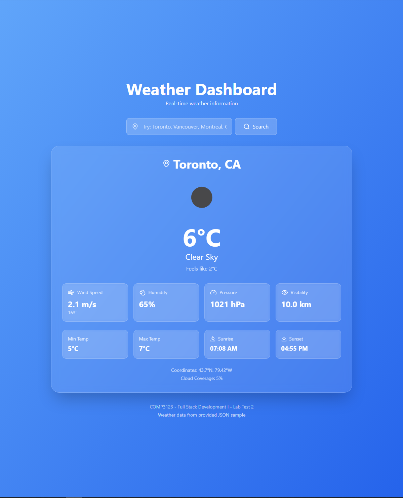
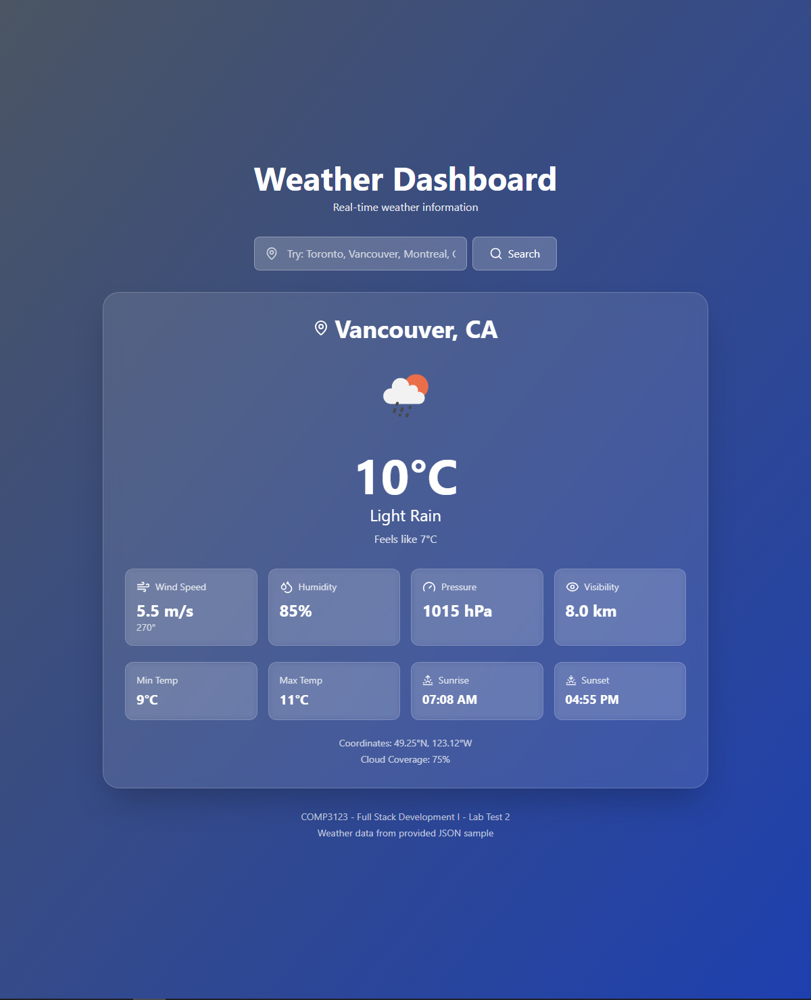
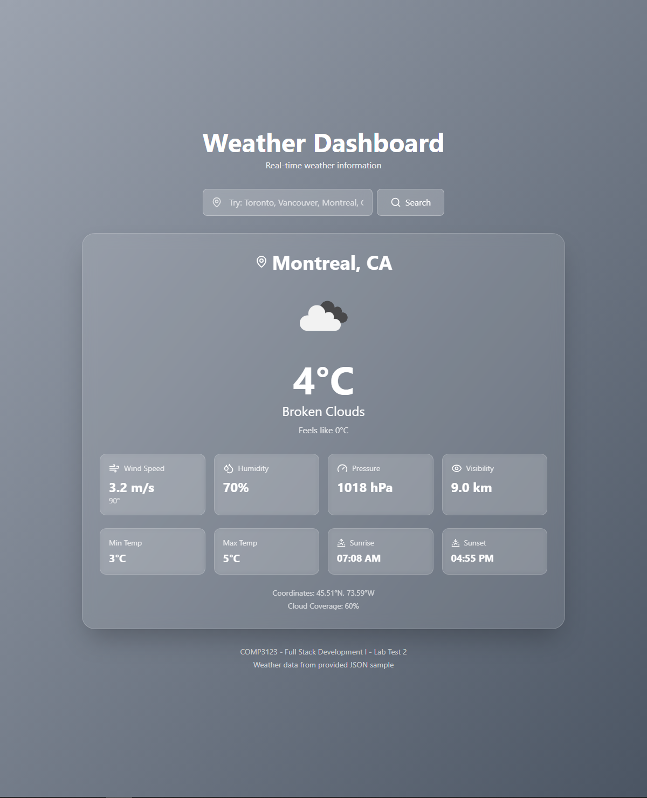
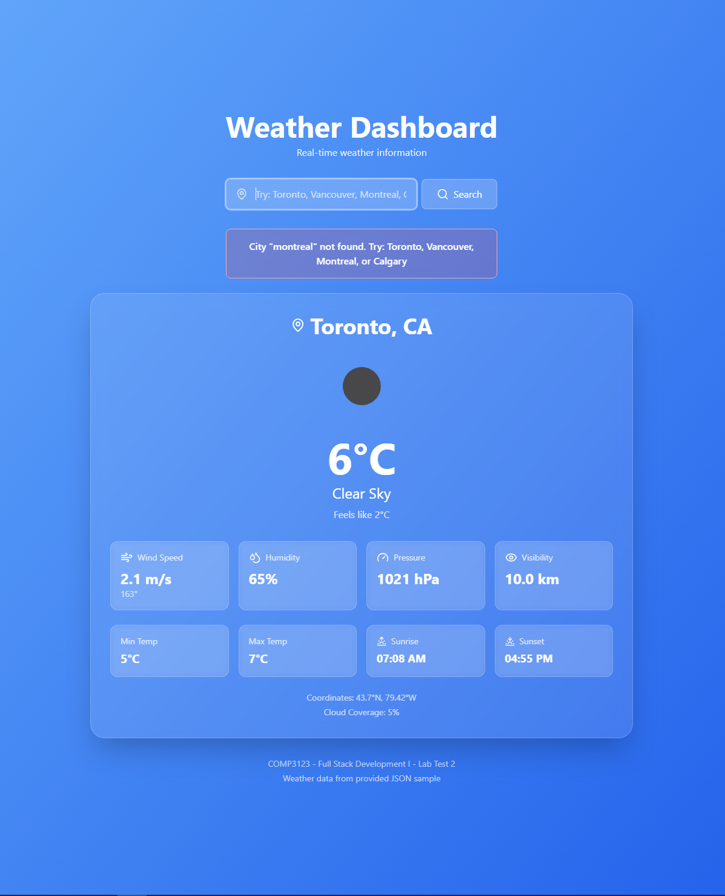

# Weather App - COMP3123 Lab Test 2

- **Student ID**: 101484793
- **Name**: [Vincente Sequeira
- **Course**: COMP3123 - Full Stack Development I
- **Date**: November 27, 2025

## Project Description
A simple React weather app that displays weather information from a JSON data file. Features a search function to view weather for different Canadian cities.

## Features
- Display weather data for Toronto (default)
- Search functionality for Toronto, Vancouver, Montreal, and Calgary
- Shows temperature, humidity, wind speed, pressure, and visibility
- Dynamic background colors based on weather conditions
- Weather icons from OpenWeatherMap

## Technologies Used
- React (Function Components)
- React Hooks (useState)
- Tailwind CSS (via CDN)
- Lucide React (icons)

## Installation

1. Clone the repository
```bash
git clone https://github.com/[username]/101484793_comp3123_labtest2.git
cd 101484793_comp3123_labtest2
```

2. Install dependencies
```bash
npm install
npm install lucide-react
```

3. Run the app
```bash
npm start
```

4. Open in browser at `http://localhost:3000`

## How to Use
- App loads with Toronto weather by default
- Type a city name in the search box: **Toronto**, **Vancouver**, **Montreal**, or **Calgary**
- Press Enter or click Search button
- Weather data updates with new city information

## React Concepts Used
- **useState**: Managing search input, weather data, and error states
- **Props**: Passing data to icon components and display functions
- **Event Handlers**: onClick, onChange, onKeyPress
- **Conditional Rendering**: Error messages and weather display

## Screenshots

### Toronto (Clear Weather)


### Vancouver (Rainy Weather)


### Montreal (Cloudy Weather)


### Search Feature


## Data Source
Uses provided `weather_api_output.json` as base data. Additional cities created with same JSON structure for demo purposes.

## GitHub Repository
[https://github.com/[username]/101484793_comp3123_labtest2](https://github.com/[username]/101484793_comp3123_labtest2)
